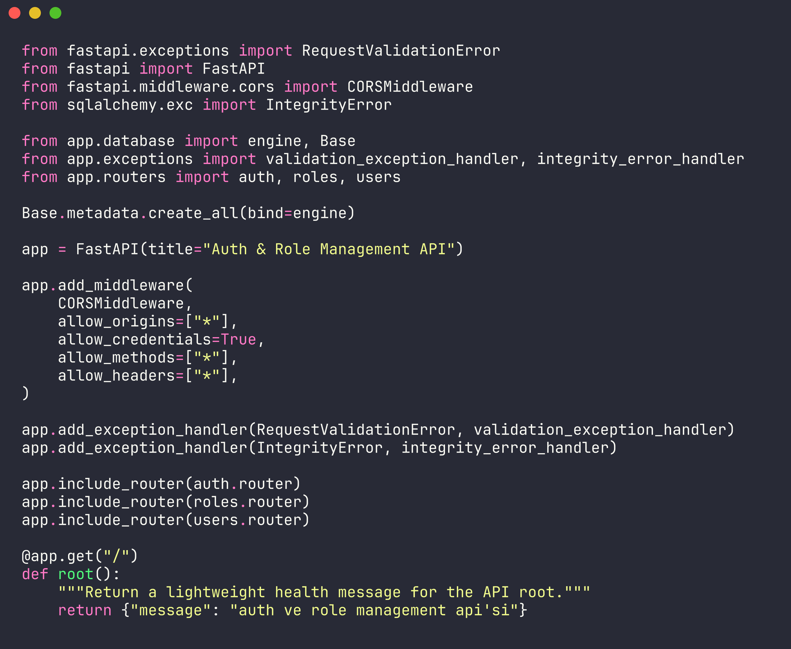

# FAPI

<div align="center">


</div>

FAPI is a compact FastAPI backend for user registration, login, JWT authentication, and admin-controlled role assignment. It is designed as a clear learning project and a practical starting point for role-aware API services.



## Features

- JWT login flow with password hashing
- User registration with username, email, and password validation
- Protected current-user endpoint
- Role creation, role lookup, and user-role assignment
- SQLAlchemy models with automatic table creation
- Centralized validation and database error handlers
- CORS-ready API configuration

## Quick Start

```bash
git clone https://github.com/mertefekurt/FAPI.git
cd FAPI
python -m venv .venv
source .venv/bin/activate
pip install -r requirements.txt
uvicorn app.main:app --reload
```

Open the interactive API documentation:

```text
http://127.0.0.1:8000/docs
```

## API Map

| Area | Endpoints |
| --- | --- |
| Authentication | `POST /auth/register`, `POST /auth/login`, `GET /auth/me` |
| Roles | `POST /roles`, `GET /roles`, `GET /roles/{role_id}` |
| Assignments | `POST /roles/{role_id}/assign/{user_id}`, `DELETE /roles/{role_id}/remove/{user_id}` |
| Users | `GET /users`, `GET /users/{user_id}` |

## Project Structure

```text
app/
  main.py          FastAPI application setup
  auth.py          JWT, hashing, and current-user dependencies
  models.py        SQLAlchemy database models
  schemas.py       Pydantic request and response models
  database.py      Engine, session, and base configuration
  validators.py    Input validation helpers
  routers/         Auth, role, and user route groups
```

## Notes

Set production-grade values for secrets, allowed origins, and database connection settings before deploying. The project is intentionally small, so each authentication and authorization concept stays easy to inspect.
