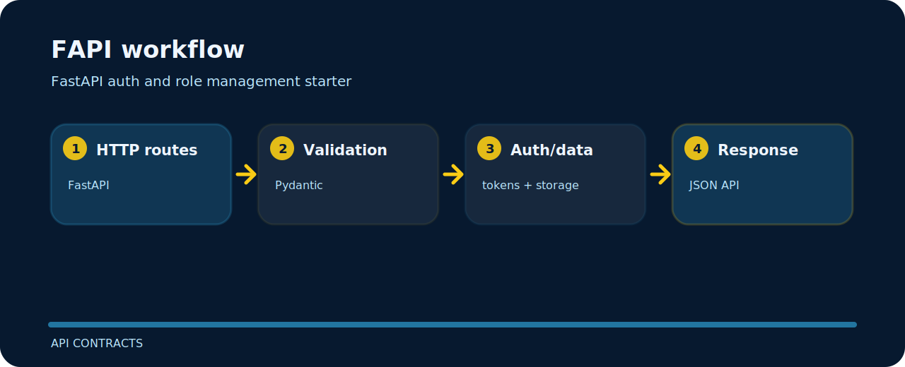

# FAPI

| Detail | Value |
| --- | --- |
| Area | api contracts |
| Entry | `uvicorn` |
| Input | small local input |
| Output | JSON API responses |


FastAPI auth and role management starter.

## Launch path

```bash
git clone https://github.com/mertefekurt/FAPI.git
cd FAPI
python -m pip install -r requirements.txt
uvicorn app.main:app --reload
```

## How it moves



## Useful edges

The project stays useful because of these small constraints:

- Designed as a focused api contracts repo.
- Keeps setup short.
- Prioritizes readable output over infrastructure.
